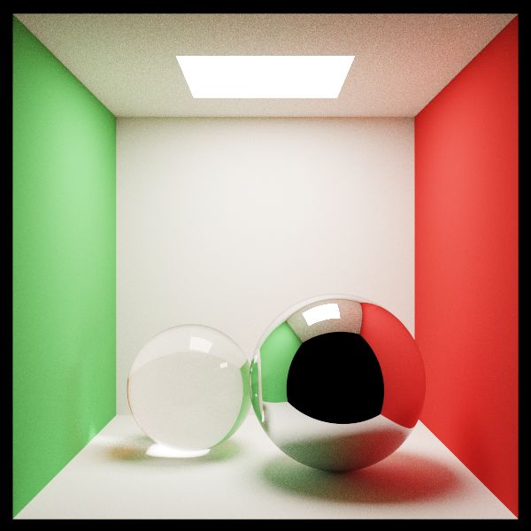
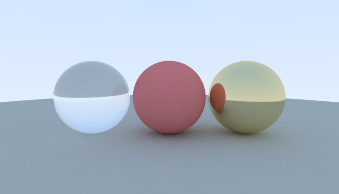
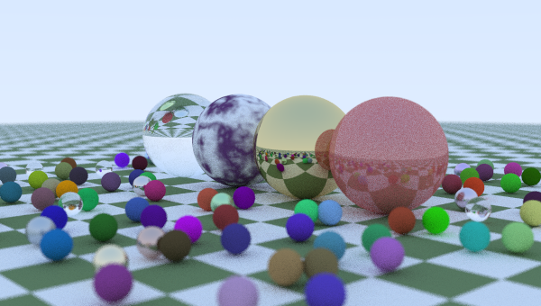
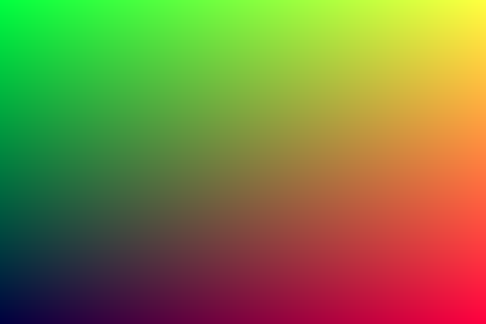

# Realistic Ray Tracing

A CPU ray tracer written from scratch in C++, following Peter Shirley's *Realistic Ray Tracing*. No graphics libraries, no engine. Just vector math and light simulation.



The Cornell Box, the standard benchmark for global illumination. The white floor picks up red and green from the walls, and the shadows fall off gradually instead of ending in a hard edge. Neither effect is coded in. Both emerge from solving the rendering equation with Monte Carlo integration.

## What's implemented

**Geometry**
- Ray-sphere and ray-triangle intersection
- Indexed triangle meshes
- Transformation matrices and object instancing
- Bounding volume hierarchy (~15x speedup)

**Camera**
- Configurable position, aim, and field of view
- Depth of field (thin lens model)
- Motion blur

**Materials**
- Lambertian diffuse
- Metal (perfect and roughened specular)
- Dielectric glass (Snell refraction, Fresnel reflectance, total internal reflection)
- Diffuse-specular (plastic)

**Textures**
- Procedural stripes and checkerboard
- Perlin noise and fractal turbulence (marble)
- Image texture mapping with UV coordinates

**Light transport**
- Monte Carlo path tracing
- Stratified sampling and antialiasing
- Importance sampling
- Direct lighting with shadow rays
- Area lights and soft shadows
- Photon mapping
- Participating media (volumetric fog)

## Renders



Glass, diffuse, and metal. Each material is a rule for how a ray scatters: diffuse goes in a random direction, metal reflects about the normal, glass refracts or reflects depending on the angle.



Marble from layered Perlin noise, a checkerboard floor computed from world coordinates, depth of field from a simulated lens, and a few hundred spheres accelerated by a BVH.



Day one. A color gradient. No 3D, no light, no geometry. Just proving I could compute a color for every pixel and write it to a file.

## Building

Every program is single-file and dependency-free.

```bash
clang++ -O2 -std=c++17 grand_finale.cpp -o grand_finale
./grand_finale
```

Each writes a `.ppm` image. The `-O2` matters, path tracing is slow without it.
